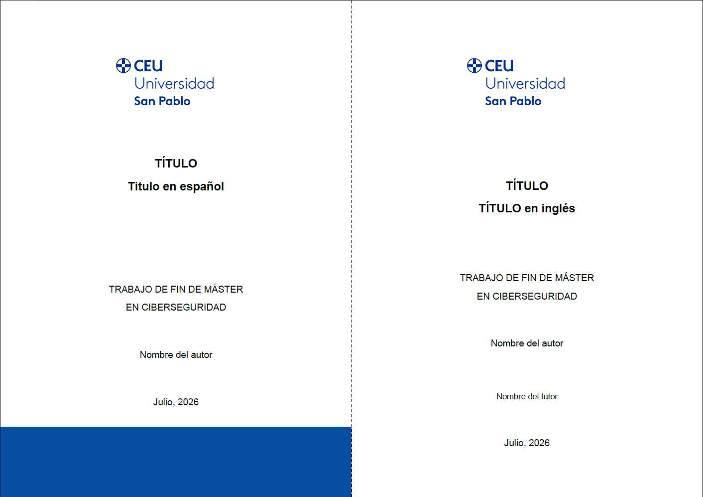
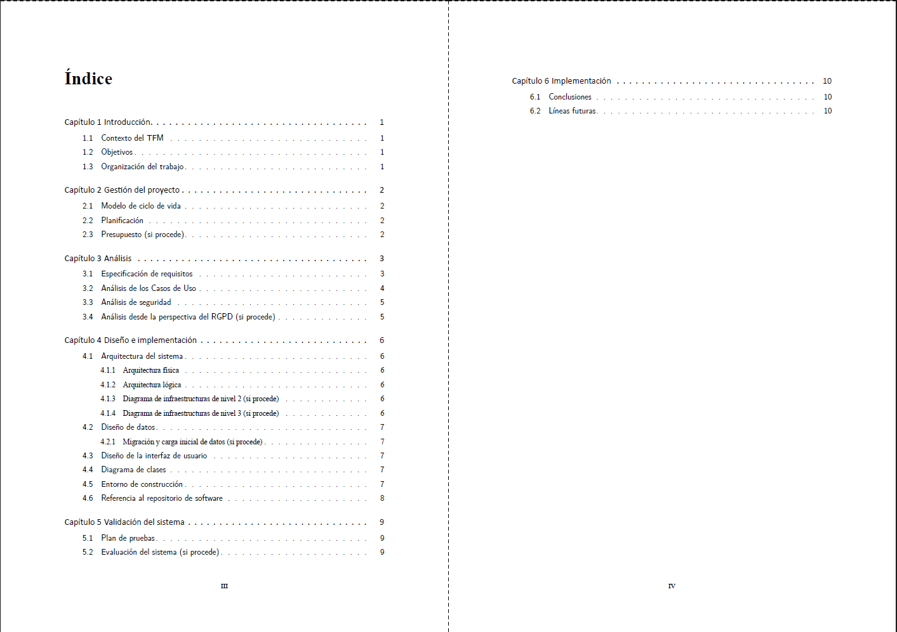
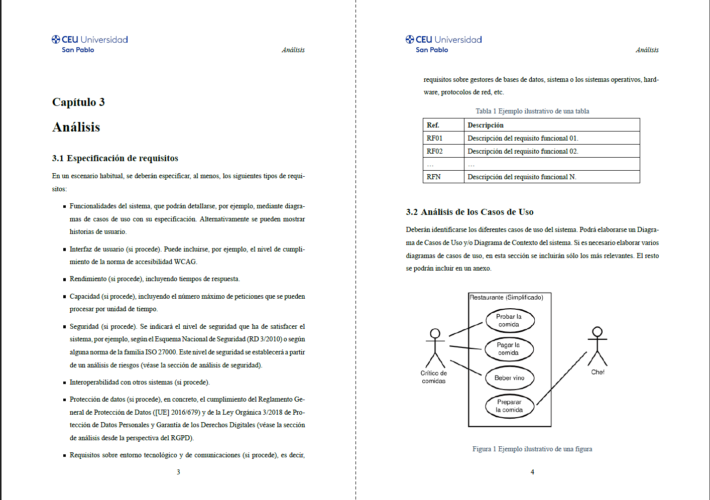

# 🎓 Plantilla TFM CEU - LaTeX


Esta es una solución modular y automatizada diseñada para la redacción de Trabajos Fin de Máster (TFM) para el máster en ciberseguridad. El objetivo principal es permitir que el alumno se centre exclusivamente en el contenido, delegando el diseño y la gestión de la estructura a un sistema basado en LaTeX y Python.

<div style="border-left: 5px solid #d9534f; padding: 12px; background-color: #fdf2f2; color: #000000ff;">
<strong>⚠️ Disclaimer: Proyecto No Oficial</strong>

Esta plantilla no es un documento oficial de la universidad. Es una herramienta independiente desarrollada para emular el formato de la plantilla de Microsoft Word: *3. Plantilla TFM_CIBER_v2.0.docx*.

Es responsabilidad del alumno verificar que el resultado final cumple con los requisitos específicos de su convocatoria y tutor antes de la entrega definitiva.
</div>

###

<p align="center">
  
  <em>Figura 1. Portadas de la plantilla</em>
</p>

## 📂 Estructura del Proyecto

```text
.
├── main.tex                   # 🎛️ Orquestador principal (Preámbulo y estructura)
├── generar_capitulos_latex.py # 🐍 Script de automatización de capítulos
├── indice.json                # 📋 Definición de la estructura del TFM
├── Bibliografia/              # 📚 Referencias y estilos (BibLaTeX)
├── Cuerpo/                    # ✍️ Contenido real (Resumen, Capítulos, Anexos)
├── Formatos/                  # 🎨 Diseño (Estilos de títulos, cabeceras, código)
├── Glosario/                  # 📖 Siglas y definiciones de términos
├── Ficheros CEU               # 📖 Documentos originales proporcionados por la universidad
├── Imagenes/                  # 🖼️ Gráficos y figuras del contenido
├── Logo/                      # 🏫 Logos institucionales (Portada/Cabecera)
└── Portada/                   # 📄 Configuración de la cubierta
```

## 🛠️ Archivos Clave

### 1. `main.tex`
Es el núcleo del proyecto. Aquí se cargan los paquetes, se definen las fuentes (Times New Roman, Arial, Calibri) y se establece el orden de las secciones. No debes escribir contenido aquí, solo gestionar qué archivos se incluyen.

### 2. `generar_capitulos_latex.py`
Un potente script de Python que:

- Lee un archivo de índice (`.json`, `.yaml`, `.toml` o `.txt`).

- Borra los capítulos antiguos de `Cuerpo/` (excepto el resumen).

- Crea los nuevos archivos `.tex` con la estructura de secciones/subsecciones.

- Actualiza automáticamente el `main.tex` insertando los comandos `\include` necesarios.

<p align="center">
  <br>
  <em>Figura 2. Ejemplo de índices</em>
</p>

<p align="center">
  <br>
  <em>Figura 3. Ejemplo de capítulo</em>
</p>


<details>
<summary>⚙️ formatos de indices </summary>

```text
Capítulo 1: Nombre del Capítulo
  Sección 1.1
  Sección 1.2
    Subsección 1.2.1
    Subsección 1.2.2

Anexos
  Anexo i: Título del Anexo
```

```json
{
  "capitulos": [
    {
      "titulo": "Nombre del Capítulo",
      "secciones": [
        "Sección Simple",
        {
          "titulo": "Sección con Hijos",
          "subsecciones": ["Subsección A", "Subsección B"]
        }
      ]
    }
  ],
  "Anexos": ["Título del Anexo"]
}
```

```yaml
capitulos:
  - titulo: "Nombre del Capítulo"
    secciones:
      - "Sección Simple"
      - titulo: "Sección con Hijos"
        subsecciones:
          - "Subsección A"
          - "Subsección B"

Anexos:
  - "Título del Anexo"
```

```toml
[[capitulos]]
titulo = "Nombre del Capítulo"
secciones = ["Sección Simple"]

[[capitulos.secciones]]
titulo = "Sección con Hijos"
subsecciones = ["Subsección A", "Subsección B"]

Anexos = ["Título del Anexo"]
```

</details>


<details>
<summary>⚙️ Ver ejemplos de formato de indices </summary>

```txt
Capítulo 1: Introducción
  1.1 Contexto del TFM
  1.2 Objetivos
  1.3 Organización del trabajo

Capítulo 2: Gestión del proyecto
  2.1 Modelo de ciclo de vida
  2.2 Planificación
  2.3 Presupuesto (si procede)

Capítulo 3: Análisis
  3.1 Especificación de requisitos
  3.2 Análisis de los Casos de Uso
  3.3 Análisis de seguridad
  3.4 Análisis desde la perspectiva del RGPD (si procede)

Capítulo 4: Diseño e implementación
  4.1 Arquitectura del sistema
    4.1.1 Arquitectura física
    4.1.2 Arquitectura lógica
    4.1.3 Diagrama de infraestructuras de nivel 2 (si procede)
    4.1.4 Diagrama de infraestructuras de nivel 3 (si procede)
  4.2 Diseño de datos
    4.2.1 Migración y carga inicial de datos (si procede)
  4.3 Diseño de la interfaz de usuario
  4.4 Diagrama de clases
  4.5 Entorno de construcción
  4.6 Referencia al repositorio de software

Capítulo 5: Validación del sistema
  5.1 Plan de pruebas
  5.2 Evaluación del sistema (si procede)

Capítulo 6: Implementación
  6.1 Conclusiones
  6.2 Líneas futuras

Anexos
  Anexo i: Código fuente (si procede)
  Anexo ii: Documentación de usuario (si procede)
  Anexo iii: Documentación técnica (si procede)
```

```yaml
capitulos:
  - titulo: "Introducción"
    secciones:
      - "Contexto del TFM"
      - "Objetivos"
      - "Organización del trabajo"

  - titulo: "Gestión del proyecto"
    secciones:
      - "Modelo de ciclo de vida"
      - "Planificación"
      - "Presupuesto (si procede)"

  - titulo: "Análisis"
    secciones:
      - "Especificación de requisitos"
      - "Análisis de los Casos de Uso"
      - "Análisis de seguridad"
      - "Análisis desde la perspectiva del RGPD (si procede)"

  - titulo: "Diseño e implementación"
    secciones:
      - titulo: "Arquitectura del sistema"
        subsecciones:
          - "Arquitectura física"
          - "Arquitectura lógica"
          - "Diagrama de infraestructuras de nivel 2 (si procede)"
          - "Diagrama de infraestructuras de nivel 3 (si procede)"
      - titulo: "Diseño de datos"
        subsecciones:
          - "Migración y carga inicial de datos (si procede)"
      - "Diseño de la interfaz de usuario"
      - "Diagrama de clases"
      - "Entorno de construcción"
      - "Referencia al repositorio de software"

  - titulo: "Validación del sistema"
    secciones:
      - "Plan de pruebas"
      - "Evaluación del sistema (si procede)"

  - titulo: "Implementación"
    secciones:
      - "Conclusiones"
      - "Líneas futuras"

Anexos:
  - "Anexo i: Código fuente (si procede)"
  - "Anexo ii: Documentación de usuario (si procede)"
  - "Anexo iii: Documentación técnica (si procede)"
```

```json
{
  "capitulos": [
    {
      "titulo": "Introducción",
      "secciones": [
        "Contexto del TFM",
        "Objetivos",
        "Organización del trabajo"
      ]
    },
    {
      "titulo": "Gestión del proyecto",
      "secciones": [
        "Modelo de ciclo de vida",
        "Planificación",
        "Presupuesto (si procede)"
      ]
    },
    {
      "titulo": "Análisis",
      "secciones": [
        "Especificación de requisitos",
        "Análisis de los Casos de Uso",
        "Análisis de seguridad",
        "Análisis desde la perspectiva del RGPD (si procede)"
      ]
    },
    {
      "titulo": "Diseño e implementación",
      "secciones": [
        {
          "titulo": "Arquitectura del sistema",
          "subsecciones": [
            "Arquitectura física",
            "Arquitectura lógica",
            "Diagrama de infraestructuras de nivel 2 (si procede)",
            "Diagrama de infraestructuras de nivel 3 (si procede)"
          ]
        },
        {
          "titulo": "Diseño de datos",
          "subsecciones": [
            "Migración y carga inicial de datos (si procede)"
          ]
        },
        "Diseño de la interfaz de usuario",
        "Diagrama de clases",
        "Entorno de construcción",
        "Referencia al repositorio de software"
      ]
    },
    {
      "titulo": "Validación del sistema",
      "secciones": [
        "Plan de pruebas",
        "Evaluación del sistema (si procede)"
      ]
    },
    {
      "titulo": "Implementación",
      "secciones": [
        "Conclusiones",
        "Líneas futuras"
      ]
    }
  ],
  "Anexos": [
    "Anexo i: Código fuente (si procede)",
    "Anexo ii: Documentación de usuario (si procede)",
    "Anexo iii: Documentación técnica (si procede)"
  ]
}
```

```toml
[[capitulos]]
titulo = "Introducción"
secciones = [
  "Contexto del TFM",
  "Objetivos",
  "Organización del trabajo"
]

[[capitulos]]
titulo = "Gestión del proyecto"
secciones = [
  "Modelo de ciclo de vida",
  "Planificación",
  "Presupuesto (si procede)"
]

[[capitulos]]
titulo = "Análisis"
secciones = [
  "Especificación de requisitos",
  "Análisis de los Casos de Uso",
  "Análisis de seguridad",
  "Análisis desde la perspectiva del RGPD (si procede)"
]

[[capitulos]]
titulo = "Diseño e implementación"

[[capitulos.secciones]]
titulo = "Arquitectura del sistema"
subsecciones = [
  "Arquitectura física",
  "Arquitectura lógica",
  "Diagrama de infraestructuras de nivel 2 (si procede)",
  "Diagrama de infraestructuras de nivel 3 (si procede)"
]

[[capitulos.secciones]]
titulo = "Diseño de datos"
subsecciones = [
  "Migración y carga inicial de datos (si procede)"
]

[[capitulos.secciones]]
titulo = "Otros"
items = [
  "Diseño de la interfaz de usuario",
  "Diagrama de clases",
  "Entorno de construcción",
  "Referencia al repositorio de software"
]

[[capitulos]]
titulo = "Validación del sistema"
secciones = [
  "Plan de pruebas",
  "Evaluación del sistema (si procede)"
]

[[capitulos]]
titulo = "Implementación"
secciones = [
  "Conclusiones",
  "Líneas futuras"
]

Anexos = [
  "Anexo i: Código fuente (si procede)",
  "Anexo ii: Documentación de usuario (si procede)",
  "Anexo iii: Documentación técnica (si procede)"
]
```
</details>


### 3. `Formatos/`
- `Cuerpo.tex`: Define cómo se ven las secciones, las cabeceras (`fancyhdr`) y el espaciado. **⚠️ NO TOCAR este fichero**

- `listings.tex`: Configura el resaltado de sintaxis para bloques de código.

- `comandos.tex`: Macros personalizadas para facilitar la escritura.

## 🚀 Guía de Uso

**1️⃣ Paso 1: Configurar la Portada**

En `main.tex`, localiza la línea de `\printportada` y rellena tus datos:

```latex
\printportada{Título del TFM}{Nombre del Autor}{Nombre del Tutor}{Julio, 2026}{TFM Title in English}
```

**2️⃣ Paso 2: Definir el Índice**
Edita `indice.json` (o un archivo `.txt`) con la estructura deseada:

```json
{
  "capitulos": [
    {
      "titulo": "Introducción",
      "secciones": ["Contexto", "Objetivos"]
    }
  ],
  "Anexos": ["Código Fuente", "Manual de Usuario"]
}
```


### 💡 Reglas de Oro para los Índices
1. **Nivel 1 (Capítulo):** Se genera como `\section{...}` y crea un nuevo archivo `.tex` en la carpeta `Cuerpo/`.

2. **Nivel 2 (Sección):** Se genera como `\subsection{...}` dentro del archivo del capítulo.

3. **Nivel 3 (Subsección):** Se genera como `\subsubsection{...}` (Configurado en tu `Cuerpo.tex` con tamaño 14pt y negrita).

4. **Anexos:** Se generan con numeración romana (`Anexo i`, `Anexo ii`) y usan `\section*` para no alterar la numeración de los capítulos principales.
###

**3️⃣ Paso 3: Ejecutar el Generador**
Abre una terminal y ejecuta:

```python
python generar_capitulos_latex.py indice.json
```

Esto preparará todos tus archivos en la carpeta `Cuerpo/` y los enlazará en el PDF.


## 💻 Configuración Recomendada (VS Code)

Para una experiencia óptima con esta plantilla en VS Code, se recomienda instalar la extensión **LaTeX Workshop** y usar la siguiente configuración:

### Compilación Inteligente
El proyecto incluye un **Recipe** personalizado:
- `Compilar TFM Completo`: Ejecuta XeLaTeX, Biber (bibliografía) y Makeglossaries (siglas) en el orden correcto. Se recomienda usar este al menos una vez al día o cuando se añadan nuevas citas/siglas.
- `XeLaTeX Rápido`: Úsalo para previsualizar cambios en el texto de forma instantánea.

### Limpieza de Basura
La configuración proporcionada en `settings.json` está programada para **borrar automáticamente** los archivos auxiliares (`.aux`, `.log`, `.toc`, etc.) cada vez que la compilación termina con éxito. Esto mantiene la carpeta del proyecto limpia y lista para subir a Overleaf o Git.

### Visualización
El PDF se abrirá automáticamente en una pestaña lateral del editor. Gracias a `synctex`, si haces **Ctrl + Click** en el PDF, VS Code te llevará a la línea exacta del código `.tex` (y viceversa).

### Requisitos de VS Code
Asegúrate de tener en tu `settings.json`:
1. El motor de compilación configurado como `xelatex`.
2. El visor de PDF en modo `tab`.
3. La limpieza automática activada (`clean.enabled: true`).

<details>
<summary>⚙️ Ver configuración completa de VS Code (settings.json)</summary>

  ```json
  {
    "latex-workshop.latex.tools": [
      {
        "name": "xelatex",
        "command": "xelatex",
        "args": [
          "-interaction=nonstopmode",
          "-synctex=1",
          "-file-line-error",
          "%DOC%"
        ]
      },
      {
        "name": "biber",
        "command": "biber",
        "args": ["%DOCFILE%"]
      },
      {
        "name": "makeglossaries",
        "command": "makeglossaries",
        "args": ["%DOCFILE%"]
      }
    ],
    "latex-workshop.latex.recipes": [
      {
        "name": "Compilar TFM Completo (XeLaTeX + Bib + Gloss)",
        "tools": [
          "xelatex",
          "biber",
          "makeglossaries",
          "xelatex",
          "xelatex"
        ]
      },
      {
        "name": "XeLaTeX Rápido",
        "tools": [
          "xelatex"
        ]
      }
    ],

    "latex-workshop.latex.autoBuild.run": "onSave",
    "latex-workshop.latex.clean.enabled": true,
    "latex-workshop.latex.clean.method": "onBuilt",
    "latex-workshop.latex.clean.fileTypes": [
      "*.aux", "*.bbl", "*.blg", "*.idx", "*.ind", "*.lof", "*.lot", "*.out", "*.toc", 
      "*.acn", "*.acr", "*.alg", "*.glg", "*.glo", "*.gls", "*.ist", "*.fls", "*.log", 
      "*.fdb_latexmk", "*.snm", "*.nav", "*.vrb", "*.run.xml", "*.bcf"
    ],

    "latex-workshop.view.pdf.viewer": "tab",
    "latex-workshop.view.pdf.refocus": true,

    "[latex]": {
      "editor.defaultFormatter": "James-Yu.latex-workshop",
      "editor.formatOnSave": true
    },

    "latex-workshop.latex.watch.files.ignore": [
      "**/node_modules/**",
      "**/.git/**"
    ]
}
```
</details>

## 🎨 Personalizaciones

**Cambio de Fuentes**
Si necesitas cambiar las fuentes oficiales, modifica estas líneas en `main.tex`:

```latex
\setmainfont{Tu Fuente}
\setmonofont{Fuente Mono}
```

**Gestión de Glosarios**
Añade tus términos en `Glosario/glosario.tex`.

- Usa `\gls{id}` para términos.
- Usa `\acrshort{id}` o `\acrlong{id}` para siglas.

LaTeX se encarga de crear el índice de términos y siglas automáticamente.

**Estilo de Código**
Para insertar código, usa el entorno definido en `listings.tex`:

```latex
\begin{lstlisting}[language=Java, caption=Ejemplo de JDBC]
// Tu código aquí
\end{lstlisting}
```


**Cabeceras Personalizadas**

Puedes cambiar el texto de la cabecera en cada capítulo usando el comando:

```latex
\nombreCapituloCabecera{RH}{Título de la Cabecera}
```

## ⚠️ Notas Importantes
- Compilador: Es obligatorio usar XeLaTeX o LuaLaTeX debido al uso del paquete `fontspec` para las fuentes del sistema.

- Limpieza: El script generador crea archivos `.bak` de seguridad. Puedes eliminarlos si no los necesitas.

- Resumen: El archivo `00_Resumen_Abstract.tex` está protegido; el script nunca lo borrará.