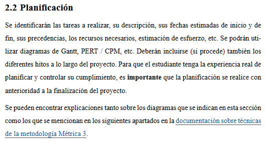
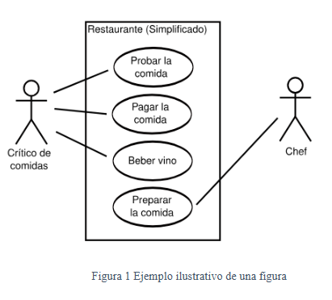
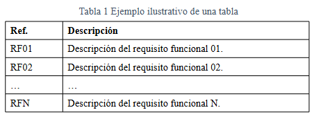

# 🎓 Plantilla TFM CEU - LaTeX


Esta es una solución modular y automatizada diseñada para la redacción de Trabajos Fin de Máster (TFM) para el máster en ciberseguridad. El objetivo principal es permitir que el alumno se centre exclusivamente en el contenido, delegando el diseño y la gestión de la estructura a un sistema basado en LaTeX y Python.

> [!WARNING] 
> **Disclaimer: Proyecto No Oficial**  
>  
> Esta plantilla no es un documento oficial de la universidad. Es una herramienta independiente desarrollada para emular el formato de la plantilla de Microsoft Word: *3. Plantilla TFM_CIBER_v2.0.docx*.  
>  
> Es responsabilidad del alumno verificar que el resultado final cumple con los requisitos específicos de su convocatoria y tutor antes de la entrega definitiva.

### 📑 Índice del README
- [📂 Estructura del Proyecto](#-estructura-del-proyecto)  
- [🛠️ Archivos Clave](#️-archivos-clave)  
  - [1. main.tex](#1-maintex)  
  - [2. conversor_indice_txt_a_json.py](#2-conversor_indice_txt_a_jsonpy)  
  - [3. generar_capitulos_latex.py](#3-generar_capitulos_latexpy)  
  - [4. Formatos](#4-formatos)  

- [🧾 Índice del TFM](#-índice-del-tfm)  

- [💻 Configuración Recomendada (VS Code)](#-configuración-recomendada-vs-code)  

- [🚀 Guía de Uso - Redacción del TFM](#-guía-de-uso---redacción-del-tfm)  

- [🎨 Personalizaciones](#-personalizaciones)  

- [📘 Buenas prácticas: Figuras, Tablas y Enlaces](#-buenas-prácticas-figuras-tablas-y-enlaces)
  - [🙍🏼‍♂️ Cabeceras](#️-configuración-de-la-cabecera-de-cada-capítulo)
  - [🔗 Enlaces](#-uso-de-enlaces)  
  - [🖼️ Figuras](#️-inserción-de-figuras)  
  - [📊 Tablas](#-inserción-de-tablas)  

- [📚 Citas, Bibliografía y Glosario](#-citas-bibliografía-y-glosario)  
  - [🔖 Citas y referencias](#1--citas-y-referencias)  
  - [📚 Bibliografía](#-2-bibliografía-automática)  
  - [📖 Glosario y siglas](#-3-glosario-y-siglas)  

- [⚠️ Notas Importantes](#️-notas-importantes)

###

<p align="center">
  
  <em>Figura 1. Portadas de la plantilla</em>
</p>

## 📂 Estructura del Proyecto

```text
.
├── main.tex                       # 🎛️ Orquestador principal (Preámbulo y estructura)
├── conversor_indice_txt_a_json.py # 🐍 Script que traduce el indice.txt a indice.json
├── generar_capitulos_latex.py     # 🐍 Script de automatización de capítulos
├── indice.json (o bien .txt)      # 📋 Definición de la estructura del TFM
├── Bibliografia/                  # 📚 Referencias y estilos (BibLaTeX)
├── Cuerpo/                        # ✍️ Contenido real (Resumen, Capítulos, Anexos)
├── Formatos/                      # 🎨 Diseño (Estilos de títulos, cabeceras, código)
├── Glosario/                      # 📖 Siglas y definiciones de términos
├── Ficheros CEU/                  # 📖 Documentos originales proporcionados por la universidad
├── Imagenes/                      # 🖼️ Gráficos y figuras del contenido
├── Logo/                          # 🏫 Logos institucionales (Portada/Cabecera)
└── Portada/                       # 📄 Configuración de la cubierta
```

## 🛠️ Archivos Clave


### 1. `main.tex`
Es el núcleo del proyecto. Aquí se cargan los paquetes, se definen las fuentes (Times New Roman, Arial, Calibri) y se establece el orden de las secciones. No debes escribir contenido aquí, solo gestionar qué archivos se incluyen.

### 2. `conversor_indice_txt_a_json.py`
Un script de Python para transformar un índice en texto plano (`.txt`) a un archivo estructurado en formato JSON.

Permite:

- Leer un índice escrito con estructura jerárquica basada en capítulos, secciones, subsecciones y anexos.

- Detectar automáticamente el nivel de cada entrada mediante su numeración (`Capítulo 1`, `4.1`, `4.1.1`, etc.).

- Limpiar los prefijos del índice para conservar únicamente los títulos reales.

- Generar un archivo `.json` compatible con el script `generar_capitulos_latex.py`.

- Guardar el resultado automáticamente junto al fichero de entrada, o en una ruta personalizada mediante el parámetro `-o`.

Su objetivo es servir como paso previo para convertir un índice redactado manualmente en un formato estructurado reutilizable dentro de la plantilla.


> [!NOTE]  
> para que funcione el `.txt` de bebe seguir un formato en concreto como se indica en la seccion [_**Índice del TFM**_](#-índice-del-tfm)

### 3. `generar_capitulos_latex.py`
Un potente script de Python que:

- Lee un archivo de índice (`.json`, `.yaml` o `.toml`).

- Borra los capítulos antiguos de `Cuerpo/` (excepto el resumen).

- Crea los nuevos archivos `.tex` con la estructura de secciones/subsecciones.

- Actualiza automáticamente el `main.tex` insertando los comandos `\include` necesarios.


### 4. `Formatos/`
- `Cuerpo.tex`: Define cómo se ven las secciones, las cabeceras (`fancyhdr`) y el espaciado. **⚠️ NO TOCAR este fichero**

- `listings.tex`: Configura el resaltado de sintaxis para bloques de código.

- `comandos.tex`: Macros personalizadas para facilitar la escritura.

## 🧾 Índice del TFM

<p align="center">
  <br>
  <em>Figura 2. Ejemplo de índices</em>
</p>


Si bien podemos crear la estructura del proyecto manualmente, contamos con un script `generar_capitulos_latex.py` que genera toda la estructura deseada. Para que funcione este script podemos usar los siguientes formatos


<details>
<summary>⚙️ Formatos de indices</summary>

💠Formato txt

```text
Capítulo 1: Nombre del Capítulo
  Sección 1.1
  Sección 1.2
    Subsección 1.2.1
    Subsección 1.2.2

Anexos
  Anexo i: Título del Anexo
```

💠Formato json

```json
{
  "capitulos": [
    {
      "titulo": "Nombre del Capítulo",
      "secciones": [
        "Sección Simple",
        {
          "titulo": "Sección con Hijos",
          "subsecciones": ["Subsección A", "Subsección B"]
        }
      ]
    }
  ],
  "Anexos": ["Título del Anexo"]
}
```

💠Formato yaml

```yaml
capitulos:
  - titulo: "Nombre del Capítulo"
    secciones:
      - "Sección Simple"
      - titulo: "Sección con Hijos"
        subsecciones:
          - "Subsección A"
          - "Subsección B"

Anexos:
  - "Título del Anexo"
```

💠Formato toml

```toml
[[capitulos]]
titulo = "Nombre del Capítulo"
secciones = ["Sección Simple"]

[[capitulos.secciones]]
titulo = "Sección con Hijos"
subsecciones = ["Subsección A", "Subsección B"]

Anexos = ["Título del Anexo"]
```

</details>


<details>
<summary>⚙️ Ver ejemplos de formato de indices </summary>

💠Ejemplo formato txt

```txt
Capítulo 1: Introducción
  1.1 Contexto del TFM
  1.2 Objetivos
  1.3 Organización del trabajo

Capítulo 2: Gestión del proyecto
  2.1 Modelo de ciclo de vida
  2.2 Planificación
  2.3 Presupuesto (si procede)

Capítulo 3: Análisis
  3.1 Especificación de requisitos
  3.2 Análisis de los Casos de Uso
  3.3 Análisis de seguridad
  3.4 Análisis desde la perspectiva del RGPD (si procede)

Capítulo 4: Diseño e implementación
  4.1 Arquitectura del sistema
    4.1.1 Arquitectura física
    4.1.2 Arquitectura lógica
    4.1.3 Diagrama de infraestructuras de nivel 2 (si procede)
    4.1.4 Diagrama de infraestructuras de nivel 3 (si procede)
  4.2 Diseño de datos
    4.2.1 Migración y carga inicial de datos (si procede)
  4.3 Diseño de la interfaz de usuario
  4.4 Diagrama de clases
  4.5 Entorno de construcción
  4.6 Referencia al repositorio de software

Capítulo 5: Validación del sistema
  5.1 Plan de pruebas
  5.2 Evaluación del sistema (si procede)

Capítulo 6: Implementación
  6.1 Conclusiones
  6.2 Líneas futuras

Anexos
  Anexo i: Código fuente (si procede)
  Anexo ii: Documentación de usuario (si procede)
  Anexo iii: Documentación técnica (si procede)
```

💠Ejemplo formato json

```yaml
capitulos:
  - titulo: "Introducción"
    secciones:
      - "Contexto del TFM"
      - "Objetivos"
      - "Organización del trabajo"

  - titulo: "Gestión del proyecto"
    secciones:
      - "Modelo de ciclo de vida"
      - "Planificación"
      - "Presupuesto (si procede)"

  - titulo: "Análisis"
    secciones:
      - "Especificación de requisitos"
      - "Análisis de los Casos de Uso"
      - "Análisis de seguridad"
      - "Análisis desde la perspectiva del RGPD (si procede)"

  - titulo: "Diseño e implementación"
    secciones:
      - titulo: "Arquitectura del sistema"
        subsecciones:
          - "Arquitectura física"
          - "Arquitectura lógica"
          - "Diagrama de infraestructuras de nivel 2 (si procede)"
          - "Diagrama de infraestructuras de nivel 3 (si procede)"
      - titulo: "Diseño de datos"
        subsecciones:
          - "Migración y carga inicial de datos (si procede)"
      - "Diseño de la interfaz de usuario"
      - "Diagrama de clases"
      - "Entorno de construcción"
      - "Referencia al repositorio de software"

  - titulo: "Validación del sistema"
    secciones:
      - "Plan de pruebas"
      - "Evaluación del sistema (si procede)"

  - titulo: "Implementación"
    secciones:
      - "Conclusiones"
      - "Líneas futuras"

Anexos:
  - "Anexo i: Código fuente (si procede)"
  - "Anexo ii: Documentación de usuario (si procede)"
  - "Anexo iii: Documentación técnica (si procede)"
```

💠Ejemplo formato yaml

```json
{
  "capitulos": [
    {
      "titulo": "Introducción",
      "secciones": [
        "Contexto del TFM",
        "Objetivos",
        "Organización del trabajo"
      ]
    },
    {
      "titulo": "Gestión del proyecto",
      "secciones": [
        "Modelo de ciclo de vida",
        "Planificación",
        "Presupuesto (si procede)"
      ]
    },
    {
      "titulo": "Análisis",
      "secciones": [
        "Especificación de requisitos",
        "Análisis de los Casos de Uso",
        "Análisis de seguridad",
        "Análisis desde la perspectiva del RGPD (si procede)"
      ]
    },
    {
      "titulo": "Diseño e implementación",
      "secciones": [
        {
          "titulo": "Arquitectura del sistema",
          "subsecciones": [
            "Arquitectura física",
            "Arquitectura lógica",
            "Diagrama de infraestructuras de nivel 2 (si procede)",
            "Diagrama de infraestructuras de nivel 3 (si procede)"
          ]
        },
        {
          "titulo": "Diseño de datos",
          "subsecciones": [
            "Migración y carga inicial de datos (si procede)"
          ]
        },
        "Diseño de la interfaz de usuario",
        "Diagrama de clases",
        "Entorno de construcción",
        "Referencia al repositorio de software"
      ]
    },
    {
      "titulo": "Validación del sistema",
      "secciones": [
        "Plan de pruebas",
        "Evaluación del sistema (si procede)"
      ]
    },
    {
      "titulo": "Implementación",
      "secciones": [
        "Conclusiones",
        "Líneas futuras"
      ]
    }
  ],
  "Anexos": [
    "Anexo i: Código fuente (si procede)",
    "Anexo ii: Documentación de usuario (si procede)",
    "Anexo iii: Documentación técnica (si procede)"
  ]
}
```

💠Ejemplo formato toml

```toml
[[capitulos]]
titulo = "Introducción"
secciones = [
  "Contexto del TFM",
  "Objetivos",
  "Organización del trabajo"
]

[[capitulos]]
titulo = "Gestión del proyecto"
secciones = [
  "Modelo de ciclo de vida",
  "Planificación",
  "Presupuesto (si procede)"
]

[[capitulos]]
titulo = "Análisis"
secciones = [
  "Especificación de requisitos",
  "Análisis de los Casos de Uso",
  "Análisis de seguridad",
  "Análisis desde la perspectiva del RGPD (si procede)"
]

[[capitulos]]
titulo = "Diseño e implementación"

[[capitulos.secciones]]
titulo = "Arquitectura del sistema"
subsecciones = [
  "Arquitectura física",
  "Arquitectura lógica",
  "Diagrama de infraestructuras de nivel 2 (si procede)",
  "Diagrama de infraestructuras de nivel 3 (si procede)"
]

[[capitulos.secciones]]
titulo = "Diseño de datos"
subsecciones = [
  "Migración y carga inicial de datos (si procede)"
]

[[capitulos.secciones]]
titulo = "Otros"
items = [
  "Diseño de la interfaz de usuario",
  "Diagrama de clases",
  "Entorno de construcción",
  "Referencia al repositorio de software"
]

[[capitulos]]
titulo = "Validación del sistema"
secciones = [
  "Plan de pruebas",
  "Evaluación del sistema (si procede)"
]

[[capitulos]]
titulo = "Implementación"
secciones = [
  "Conclusiones",
  "Líneas futuras"
]

Anexos = [
  "Anexo i: Código fuente (si procede)",
  "Anexo ii: Documentación de usuario (si procede)",
  "Anexo iii: Documentación técnica (si procede)"
]
```
</details>


## 💻 Configuración Recomendada (VS Code)

Para una experiencia óptima con esta plantilla en VS Code, se recomienda instalar la extensión **LaTeX Workshop** y usar la siguiente configuración:

### Compilación Inteligente
El proyecto incluye un **Recipe** personalizado:
- `Compilar TFM Completo`: Ejecuta XeLaTeX, Biber (bibliografía) y Makeglossaries (siglas) en el orden correcto. Se recomienda usar este al menos una vez al día o cuando se añadan nuevas citas/siglas.
- `XeLaTeX Rápido`: Úsalo para previsualizar cambios en el texto de forma instantánea.

### Requisitos de VS Code
Asegúrate de tener en tu `settings.json`:
1. El motor de compilación configurado como `xelatex`.
2. El visor de PDF en modo `tab`.
3. La limpieza automática activada (`clean.enabled: true`).

<details>
<summary>⚙️ Ver configuración completa de VS Code (settings.json)</summary>

  ```json
  {
    "latex-workshop.latex.tools": [
      {
        "name": "xelatex",
        "command": "xelatex",
        "args": [
          "-interaction=nonstopmode",
          "-synctex=1",
          "-file-line-error",
          "%DOC%"
        ]
      },
      {
        "name": "biber",
        "command": "biber",
        "args": ["%DOCFILE%"]
      },
      {
        "name": "makeglossaries",
        "command": "makeglossaries",
        "args": ["%DOCFILE%"]
      }
    ],
    "latex-workshop.latex.recipes": [
      {
        "name": "Compilar TFM Completo (XeLaTeX + Bib + Gloss)",
        "tools": [
          "xelatex",
          "biber",
          "makeglossaries",
          "xelatex",
          "xelatex"
        ]
      },
      {
        "name": "XeLaTeX Rápido",
        "tools": [
          "xelatex"
        ]
      }
    ],

    "latex-workshop.latex.autoBuild.run": "onSave",
    "latex-workshop.latex.clean.enabled": true,
    "latex-workshop.latex.clean.method": "onBuilt",
    "latex-workshop.latex.clean.fileTypes": [
      "*.aux", "*.bbl", "*.blg", "*.idx", "*.ind", "*.lof", "*.lot", "*.out", "*.toc", 
      "*.acn", "*.acr", "*.alg", "*.glg", "*.glo", "*.gls", "*.ist", "*.fls", "*.log", 
      "*.fdb_latexmk", "*.snm", "*.nav", "*.vrb", "*.run.xml", "*.bcf"
    ],

    "latex-workshop.view.pdf.viewer": "tab",
    "latex-workshop.view.pdf.refocus": true,

    "[latex]": {
      "editor.defaultFormatter": "James-Yu.latex-workshop",
      "editor.formatOnSave": true
    },

    "latex-workshop.latex.watch.files.ignore": [
      "**/node_modules/**",
      "**/.git/**"
    ]
}
```
</details>


## 🚀 Guía de Uso - Redacción del TFM

https://github.com/user-attachments/assets/743e800f-8fae-481d-b68d-001b2f3f461d

**0️⃣ Paso 0. Creación de la estructura del TFM** 

Para redactar el TFM primero debemos definir su estructura, es decir, crear el indice. Para ello podemos usar diferentes formatos como se indica en la seccion [_**Índice del TFM**_](#-índice-del-tfm)

Guardamos la estructura creada en un fichero `indice.txt`, o bien en los demás formatos, en la carpeta del proyecto.


**1️⃣ Paso 1: Configurar la Portada**

En `main.tex`, localiza la línea de `\printportada` y rellena tus datos:

```latex
\printportada{Título del TFM}{Nombre del Autor}{Nombre del Tutor}{Julio, 2026}{TFM Title in English}
```

**2️⃣ Paso 2: Definir el Índice (opcional)**

Necesitamos el fichero `indice.json` con la estructura deseada. Si partimos de un fichero `.txt`  (_**[ver generador de indice.json](#2-conversor_indice_txt_a_jsonpy)**_) debemos generarlo para ello usamos el script [`conversor_indice_txt_a_json.py`](#2-conversor_indice_txt_a_jsonpy):

Abre una terminal y ejecuta:

```python
python .\conversor_indice_txt_a_json.py indice.txt
```

Obtenemos un fichero llamado `indice.json` como el siguiente:

```json
{
  "capitulos": [
    {
      "titulo": "Introducción",
      "secciones": ["Contexto", "Objetivos"]
    }
  ],
  "Anexos": ["Código Fuente", "Manual de Usuario"]
}
```

> [!NOTE]  
> Si ya escribimos el indice en formato `JSON` no es necesario realizar este paso

### 💡 Reglas de Oro para los Índices
1. **Nivel 1 (Capítulo):** Se genera como `\section{...}` y crea un nuevo archivo `.tex` en la carpeta `Cuerpo/`.

2. **Nivel 2 (Sección):** Se genera como `\subsection{...}` dentro del archivo del capítulo.

3. **Nivel 3 (Subsección):** Se genera como `\subsubsection{...}` (Configurado en tu `Cuerpo.tex` con tamaño 14pt y negrita).

4. **Anexos:** Se generan con numeración romana (`Anexo i`, `Anexo ii`) y usan `\section*` para no alterar la numeración de los capítulos principales.
###


**3️⃣ Paso 3: Ejecutar el Generador**

Aunque podemos generar manualmente los ficheros en el directorio `Cuerpo/`, si contamos con la estructura podemos generar todos los ficheros necesarios usando el script [`generar_capitulos_latex.py`](#3-generar_capitulos_latexpy)

Abre una terminal y ejecuta:

```python
python generar_capitulos_latex.py indice.json
```

Esto preparará todos tus archivos en la carpeta `Cuerpo/` y los enlazará en el PDF.


## 🎨 Personalizaciones

**Cambio de Fuentes**
Si necesitas cambiar las fuentes oficiales, modifica estas líneas en `main.tex`:

```latex
\setmainfont{Tu Fuente}
\setmonofont{Fuente Mono}
```

**Gestión de Glosarios**
Añade tus términos en `Glosario/glosario.tex`.

- Usa `\gls{id}` para términos.
- Usa `\acrshort{id}` o `\acrlong{id}` para siglas.

LaTeX se encarga de crear el índice de términos y siglas automáticamente.

**Estilo de Código**
Para insertar código, usa el entorno definido en `listings.tex`:

```latex
\begin{lstlisting}[language=Java, caption=Ejemplo de JDBC]
// Tu código aquí
\end{lstlisting}
```


## 📘 Buenas prácticas: Figuras, Tablas y Enlaces

### 🖊️ Configuración de la cabecera de cada capítulo

Puedes cambiar el texto de la cabecera en cada capítulo usando el comando:

```latex
\nombreCapituloCabecera{RH}{Título de la Cabecera}
```

--- 

### 🔗 Uso de enlaces

```latex
% \enlace{url}{texto_visible}

\enlace{https://administracionelectronica.gob.es/...}{documentación sobre técnicas de la metodología Métrica 3}
```

<p align="center">
  <br>
  <em>Figura 3. Ejemplo de enlace</em>
</p>


---

### 🖼️ Inserción de figuras

```latex
\begin{figure}[H]
    \includegraphics{Imagenes/Imagen-ejemplo.png}

    \captionazul{Ejemplo ilustrativo de una figura}
\end{figure}
```

<p align="center">
  <br>
  <em>Figura 4. Ejemplo de figura</em>
</p>


---

### 📊 Inserción de tablas

```latex
\begin{table}[h]
    \centering
    \captionazul{Ejemplo ilustrativo de una tabla}

    \setlength{\arrayrulewidth}{0.05mm}
    \begin{tabular}{|p{2cm}|p{10cm}|}
        \hline
        \textbf{Ref.} & \textbf{Descripción} \\
        \hline
        RF01 & Descripción del requisito funcional 01. \\
        \hline
        RF02 & Descripción del requisito funcional 02. \\
        \hline
        \ldots & \ldots \\
        \hline
        RFN & Descripción del requisito funcional N. \\
        \hline
    \end{tabular}
    \label{tab:requisitos_funcionales}
\end{table}
```

<p align="center">
  <br>
  <em>Figura 4. Ejemplo de figura</em>
</p>

---

### ⚠️ Reglas importantes

- ❌ NO usar comandos estándar (`\caption`, `\href`)
- ✅ Usar siempre los personalizados (`\captionazul`, `\enlace`)


## 📚 Citas, Bibliografía y Glosario


### 1. 🔖 Citas y referencias
---


La plantilla utiliza comandos personalizados para gestionar citas de forma uniforme.

#### 📌 Cita con texto + página

```latex
\footcitepage{La seguridad es esencial}{nist2024}{15}
```

👉 Muestra el texto citado y añade una nota al pie con referencia completa + página.

---

#### 📌 Cita solo en nota al pie

```latex
\footbibliographypage{nist2024}{15}
```

---

#### 🌐 Citas web

```latex
\footweb{owasp2024}
```

```latex
\footwebfragment{owasp2024}{Validar entradas}
```

```latex
\footwebcite{Texto citado}{owasp2024}{Fragmento relevante}
```

---

#### 📖 Definiciones con referencia

```latex
\footcitedefinition{Confidencialidad}{iso27001}{8}
```


## 📚 2. Bibliografía (automática)

La bibliografía se gestiona con **BibLaTeX + Biber**.

📁 Archivo: `Bibliografia/bibliografia.bib`

```bibtex
@book{clave_unica,
  author    = {Apellido, Nombre},
  title     = {Título del libro},
  edition   = {Edición},
  year      = {Año},
  publisher = {Editorial},
  location  = {Ciudad}
}
```

Ejemplo:

```bibtex
@book{somerville_software_engineering,
  author = {Somerville, Ian},
  title = {Software Engineering},
  year = {2015}
}
```

### 🔧 Cómo funciona

1. Añades referencias al `.bib`
2. Usas comandos de cita en el texto
3. La bibliografía se genera automáticamente:

```latex
\printbibliography
```

---

## 📖 3. Glosario y siglas

📁 Archivo: `Glosario/glosario.tex`


### 🔤 Definir términos

```latex
\newglossaryentry{clave}{
    name={Nombre visible},
    description={Descripción del término}
}
```

Ejemplo

```latex
\newglossaryentry{backend}{
    name=Backend,
    description={Sistema de servidores y lógica}
}
```

Uso en el texto:

```latex
\gls{backend}
```


### 🔠 Definir siglas

```latex
\newacronym{clave}{SIGLA}{Nombre completo}
```

Ejemplo:

```latex
\newacronym{api}{API}{Interfaz de Programación de Aplicaciones}
```

Uso:

```latex
\acrshort{api}
\acrlong{api}
```

---

### 🖨️ Generar glosario

El proyecto ya contempla esto y genera automaticamente el glosario en el lugar correcto según la plantilla proporcionada

```latex
\crearglosario
```

✔ Añade automáticamente:
- Glosario de siglas
- Definiciones
- Todas las entradas (aunque no se usen)


#### ⚠️ Buenas prácticas

- Usa SIEMPRE los comandos personalizados (no \cite manual)
- Mantén el `.bib` organizado
- Define términos clave en el glosario
- No repitas definiciones en el texto


## ⚠️ Notas Importantes
- Compilador: Es obligatorio usar XeLaTeX o LuaLaTeX debido al uso del paquete `fontspec` para las fuentes del sistema.

- Limpieza: El script generador crea archivos `.bak` de seguridad. Puedes eliminarlos si no los necesitas.

- Resumen: El archivo `00_Resumen_Abstract.tex` está protegido; el script nunca lo borrará.
